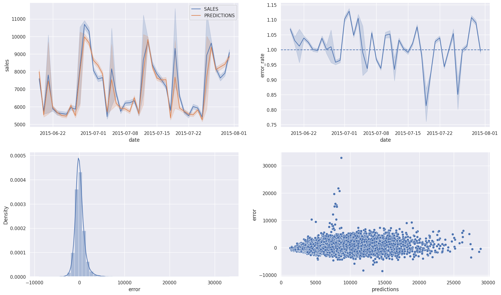

# Rossmann Store Project

**Author**: Bruno Piato

**Date**: 2023-05-20

**Description**: This is a portfolio project I developed along with the "DS em Produção" classes of Comunidade Data Science. We used a drugstores dataset to predict sales for the next six weeks for each store using time series analysis and machine learning algorithms.

---
## 1. Introduction

### 1.1 The Businness
Rossmann company operates over 4,000 drugstores around European countries such as Germany, Poland, Hungary, the Czech Republic, Turkey, Albania, Kosovo, Israel and Spain with a revenue of over €10 billion. 

In 2015 they published their data on Kaggle and created a [Kaggle competition](https://www.kaggle.com/c/rossmann-store-sales). The main goal was to predict the sales for the next 6 weeks once the CFO was intending to invest in improvements to the stores.

### 1.2. Final Product

During the process of final product building, a API was created so it can be acessed from different devices and applications, returning the algorithm's prediction for a chosen store. 

### 1.3. Tools Used in the Project
To build this solution the following tools were used:

- Python programming language version 3.11.2
- Git and GitHub for code version control
- Jupyter Notebook to data analysis and prototyping
- Heroku Cloud service
- Techniques for data cleaning, wrangling and manipulation using different libraries in Python
- Techniques for dimensionality reduction and feature selection in Python
- Machine Learning algorithms as implemented in the scikit-learn library in Python

## 2. The approach
To achieve this, we used a combination of time series analysis and machine learning algorithms, following the steps inside the CRISP-DM methodology:

### The steps of CRISP-DM adapted to a Data Science project

#### 1. Problem definition
In this step we focus in understanding the problem and the needs of the stakeholders so we can better develop the solutuion.

#### 2. Business understanding
Here we deepen our business understanding so we can better assess the details and characteristics of the problem.

#### 3. Data collection
Acquiring the data needed to bring out a data solution is not always a simple task. Here the data needed to solve the problem was collected by Rossmann company and made available through Kaggle platform.

#### 4. Data cleaning
We need to make the dataset as cleaning and uniform as possible, to make it easier for the machine learning algorithms to work with. We need to standadize the features names, treat outliers and missing values, etc.

#### 5. Exploratory data analysis
The Exploratory data analysis (EDA) is the first step in the data science process. Here we can see and compare the features and understand its characteristics, such as maximum, minimum, mean, stadandard deviation, etc. We can also assess the relationship between the features in bivariate and multivariate analysis.

#### 6. Data preparation 
After the EDA step we are read to prepare the data for machine learning algorithms. We may need to transforme, standardize and rescale some features. We may need some feature engineering and feature selection as well to assure the best model performance possible.

#### 7. Model training
This is the core step of a Data Science project. It is in this step that the machine learning algorithms are trained and it is our job to evaluate our business problem and choose the best models to solve it.

#### 8. Model selection and evaluation
Once the models are trained, we need to evaluate them and choose the best one to move on to the next step. We can use a variety of evaluation metrics, such as accuracy, precision, recall, F1 score, etc depending on the type of problem we are aiming to solve.

#### 9. Deployment
In this final step we can deploy the best model to the production environment so the users benefit from it making the needed predictions to make their business decisions.

## 3. Data Acquisition

The dataset was obtained directly in the [Kaggle page for the competition](https://www.kaggle.com/competitions/rossmann-store-sales/overview). It comprises 1.017.209 sales events by the over a thousand stores.

The sales dataset is composed by nine different features and the stores characteristics dataset of ten other features. The Store id was used to combine these two datasets. The feature CompetitionSinceYear was merged with CompetitionSinceMonth and the feature Promo2SinceYear was combined with Promo2SinceWeek, resulting in sixteen different features to work with.

| Feature                           | Description |
|:----------------------------------|:------------------|
| Store                             | Unique identification number for each store |
| Date                              | Date of the sale event |
| DayOfWeek                         | Numeric variable representing the day of week |
| Sales                             | Sale revenue of the day |
| Customers                         | Number of clients in the store for the day |
| Open                              | An indicator if a store was opened (1) or closed (0) in a specific day |
| StateHoliday                      | Indicates of the day was a state holiday (a), Easter holiday (b) or Christmas holiday (c). Otherwise (0) |
| SchoolHoliday                     | Indicates if a store was opened or closed due to a school holiday |
| StoreType                         | Indicates different types of store (a, b, c, or d) |
| Assortment                        | Indicates the products variability: a = basic, b = extra, c = extended |
| CompetitionDistance               | Distance (in meters) to the closest competitor |
| CompetitionOpenSince [Month/Year] | The month and year when a competitor opened |
| Promo                             | Indicates if the store currently have any promo |
| Promo2                            | Indicates if the store extended the promo timespan: 0 = did not extend, 1 = extended |
| Promo2Since [Year/Week]           | The year and week when a store extended the promo |
| PromoInterval                     | The interval of the duration of the extended promo  |

## 4. Exploratory Data Analysis

### 4.1 Main Hypothesis and Insights

## 5. Data Modelling

For the first cycle of the CRISP-DM method, five different algorithms were tested. The one with best performance was used for the model deployment. Once it was the first cycle of the project, the selected algorithms were as simple as possible.

The five selected algorithms were:

- Avarege Model
- Linear Regression
- Regularized Linear Regression - Lasso
- Random Forest Regressor
- XGBoost Regressor

Every model was trained and tested to verify which one of them presented the best perfomance metrics. To choose the best features the Boruta algorithm was used along with the insights taken from the Exploratory Data Analysis step.

To achive the best result from the training and performance analysis for each model a cross-validation method was implemented. Once the businness problem here is a time series prediction problem, a serial cross-validation was implemented, repeating the sampling in different successive sections of the dataset to test the training step as illustrated in the image bellow. Once it was the first CRISP cycle, a K-fold number of five sections was determined for the train and validation split.

The results for the implemented models Mean Absolute Error (MAE), Mean Absolute Percent Error (MAPE) and Root Mean Square Error (RMSE) were as follows:

| Model                         |             MAE CV |       MAPE CV |            RMSE CV |
| :---------------------------- | -----------------: | ------------: | -----------------: |
| Linear Regression             | 2081.73 +/- 295.63 |  0.3 +/- 0.02 | 2952.52 +/- 468.37 |
| Linear Regression Regularized |  2116.38 +/- 341.5 | 0.29 +/- 0.01 | 3057.75 +/- 504.26 |
| Random Forest Regressor       |  837.66 +/- 218.22 | 0.12 +/- 0.02 | 1255.81 +/- 318.76 |
| XGBoost Regressor             | 1045.83 +/- 182.93 | 0.14 +/- 0.02 |  1509.2 +/- 260.07 |

According to these results the two best performing algorithms were the Random Forest Regressor and the XGBoost Regressor, respectively. However, as the XGBoost Regressor is faster to be trained and implemented, requires smaller disk space and the error between these two models were quite small, the XGBoost Regressor was chosen as the selected model to be implemented from this step forward.

Once the best performing model was chosen, a Random Search Hyperparameter Fine Tuning strategy was implemented to save some time and find the better parameter values for the model to be trained with, gaining some performance improvement (MAE: *763.72*, MAPE *0.11* and RMSE *1095.35*). 

In the following dashboard we can evaluate the model. The top left chart shows the actual sale and the predictions made by the model during the training and validation period. The top right chart shows the prediction error rate during the training period. The following two charts show de distribution of errors, where is possible to observe a normal error distribution. These charts show that the model can make reliable predictions, although it can be further improved

## 6. Next Steps

To further improve the algorithm's performance a few steps can be taken:
- Use other fine-tuning strategies such as Grid Search or Bayesian Search
- Inspect the feature importance table and cycle again through the feature engineering step
- Test other machine learning algorithms
- Test some ensemble and embedding techniques